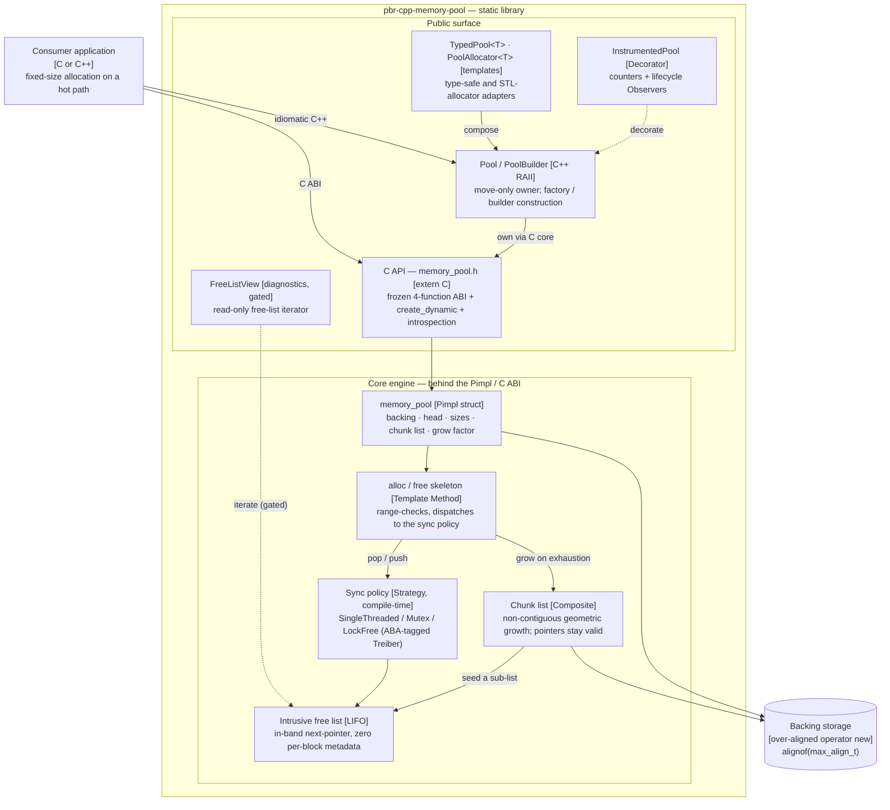

# Software Specification: Purpose-built reference High-Performance Memory Pool Manager (C/C++)

> **Status — reconciled with the as-built system.** This document was originally a
> short greenfield brief. The library has since shipped (public API frozen at
> `v1.0.0`) and every non-trivial decision is recorded in an
> [Architecture Decision Record](../adr/). Each requirement below now cross-links the
> ADR(s) that realize it; [Section 7](#7-implementation-status--decision-records) maps
> the whole specification to its ADRs and lists the explicitly deferred items.

## 1. Objective & Business Context

Many high-performance systems (e.g. graphics engines, financial trading servers, databases) suffer from memory fragmentation and the overhead generated by frequent `malloc`/`free` or `new`/`delete` calls.
This component provides a **custom memory allocator** (Memory Pool) that pre-allocates a contiguous block of memory, handling the allocation and deallocation of fixed-size blocks in constant time $O(1)$ with zero **external** fragmentation.

**Fragmentation scope (precise claim).** Fixed-size blocks eliminate *external* fragmentation *within a pool*: any free block satisfies any request, so free memory never degrades into unusable holes. The pool does **not** eliminate *internal* fragmentation — a caller that stores an object smaller than `block_size` wastes the difference. Choosing `block_size` to match the dominant object size is the caller's responsibility; the pool trades internal fragmentation for $O(1)$ determinism and zero external fragmentation by design.

---

## 2. Functional Requirements

### 2.1 Initialization

The system pre-allocates a memory pool, specifying the block size (`block_size`) and the maximum number of blocks (`block_count`). The `block_size * block_count` product must not overflow `size_t`; the constructor rejects overflow and degenerate arguments. See [ADR-0009](../adr/0009-free-list-layout-block-size-constraints-and-alignment-guarantee.md).

### 2.2 Allocation ($O(1)$)

Return a pointer to a free block in constant time. When the pool is exhausted the behaviour depends on the growth mode:

- **Fixed pool (default):** return `NULL` (C) or throw (C++ wrapper, [ADR-0016](../adr/0016-exception-policy-at-the-c-cpp-boundary.md)).
- **Dynamic pool:** acquire a **new, separate contiguous chunk** and satisfy the request from it. The growth strategy is **non-contiguous chunked expansion via a linked chunk list** — the pool is *not* a single contiguous region once it has grown, and it never relocates: **every previously returned pointer stays valid across growth** (no `realloc`-style invalidation). Growth is geometric (a configurable factor). Consequently, pointer-range validation (Section 6.1) is a **multi-chunk** membership test, not a single range check. This resolves the original brief's ambiguity in favour of chunk-linking over address-space reserve-and-commit. See [ADR-0022](../adr/0022-dynamic-growth-policy-and-chunk-linking.md), [ADR-0023](../adr/0023-composite-chunk-list-representation.md), [ADR-0024](../adr/0024-dynamic-growth-synchronization-and-creation-surface.md).

### 2.3 Deallocation ($O(1)$)

Mark a previously allocated block available again in constant time, without returning it to the operating system immediately. Freeing `NULL` or a pointer foreign to the pool is a defined, silent no-op; see [Section 5.3](#53-error-semantics) and [ADR-0012](../adr/0012-foreign-pointer-and-out-of-range-pointer-policy.md).

### 2.4 Thread Safety

Concurrent access is governed by a **compile-time policy knob** (`PBR_MEMORY_POOL_THREAD_SAFETY`) selecting one of three strategies, so single-thread users pay nothing:

- `NONE` — single-threaded fast path (intentionally racy; never share such a pool across threads);
- `MUTEX` — a mutex guards the free list;
- `LOCKFREE` — a Treiber-stack free list whose head is an **ABA-tagged pointer** (`{pointer, tag}`, the tag incremented on every CAS) so the classic ABA hazard on a LIFO free list cannot mis-link.

See [ADR-0020](../adr/0020-thread-safety-strategy-and-compile-time-knob.md). A contended, multi-thread benchmark exists (Section 6.3).

---

## 3. Non-Functional Requirements

### 3.1 No Memory Leaks

When the pool is destroyed, all pre-allocated memory (every chunk, for a grown pool) is returned to the operating system. Verified under Valgrind and the sanitizers (Section 6).

### 3.2 Minimal Memory Overhead

Free blocks carry **zero** per-block metadata — the free-list next-pointer is stored *in-band* inside the free block (Section 4). The only fixed cost is one pool-header struct plus, for dynamic pools, one small descriptor per chunk. The per-pool metadata budget is quantified and guarded in [ADR-0015](../adr/0015-metadata-overhead-budget-and-introspection.md).

### 3.3 Compatibility

Written to standard **ANSI C ABI** (the four-function surface) with an idiomatic **C++17** wrapper layer, no external runtime dependencies. Toolchain matrix and supported platforms: [ADR-0005](../adr/0005-toolchain-matrix-and-supported-platforms.md).

---

## 4. Logical Architecture & Algorithm (Free List)

The pool manages free memory using a **Free List** implicit within the blocks themselves. When a block is free, its first bytes store a pointer to the next free block. This zeroes the metadata overhead for unused blocks.

```text
+-------------------------------------------------------------------+
|                           Memory Pool                             |
+-------------------------------------------------------------------+
| [Block 1 (Free)]      -> Holds a pointer to Block 2               |
| [Block 2 (Allocated)] -> Holds user data                         |
| [Block 3 (Free)]      -> Holds a pointer to Block 4               |
| [Block 4 (Free)]      -> Holds NULL (end of list)                 |
+-------------------------------------------------------------------+
```

### 4.1 Constraints & Guarantees

Storing a next-pointer in-band imposes constraints, all enforced by the implementation ([ADR-0009](../adr/0009-free-list-layout-block-size-constraints-and-alignment-guarantee.md)):

- **Minimum block size:** `block_size >= sizeof(void*)` — the constructor rejects smaller sizes.
- **Alignment:** every returned pointer is aligned to `alignof(std::max_align_t)`, uniformly. A weaker or caller-specified per-pool alignment was considered and **deliberately rejected** (the frozen C signature carries no alignment parameter; uniform strong alignment keeps `TypedPool<T>` a trivial cast).
- **Strict-aliasing-safe access:** the in-band pointer is read/written through the canonical `*static_cast<void**>(slot)` idiom, not a type-punning cast of the user type.

The intrusive-free-list design was chosen over a bitmap allocator; the rejected alternative and its rationale are recorded in [ADR-0009](../adr/0009-free-list-layout-block-size-constraints-and-alignment-guarantee.md).

An in-band next-link is also a classic use-after-free / pointer-corruption primitive. An **opt-in debug-hardening mode** (compile-time knob `PBR_MEMORY_POOL_HARDENING`, OFF by default; [ADR-0043](../adr/0043-opt-in-debug-hardening.md)) hardens the free list against it: freed-block **poisoning** (use-after-free), a trailing per-slot **guard word** (buffer overflow past `block_size`, and double-free), and glibc-style **safe-linking** of the next-link (`ptr XOR (slot_addr >> 12)`). The guard lives in *added* slot stride, so the constraints above — the usable `block_size` and the uniform alignment — are unchanged, and the default build is byte-for-byte and cycle-for-cycle unaffected (the mechanism is fully compiled out).

### 4.2 Component diagram (C4)

The C4-model **Component** view below relates the public surface, the core engine (which lives behind the opaque `memory_pool_t` handle / Pimpl), and the operating-system backing store. It is authored in Mermaid per [ADR-0041](../adr/0041-mermaid-diagram-tooling.md); a viewer without Mermaid support sees the equivalent source. Solid arrows are runtime call / ownership paths; dashed arrows are optional or diagnostic relationships. Bracketed tags name the realizing technology or the design pattern applied.



---

## 5. API / Public Interface

### 5.1 C core (frozen at `v1.0.0`)

```c
typedef struct memory_pool memory_pool_t;

// Initialize a fixed-capacity memory pool
memory_pool_t* memory_pool_create(size_t block_size, size_t block_count);

// Initialize a dynamically-growing pool (geometric chunk expansion; ADR-0022)
memory_pool_t* memory_pool_create_dynamic(size_t block_size, size_t block_count,
                                           size_t growth_factor);

// Allocate a block from the pool (O(1)); NULL when a fixed pool is exhausted
void* memory_pool_alloc(memory_pool_t* pool);

// Release a block back into the pool (O(1))
void memory_pool_free(memory_pool_t* pool, void* block);

// Destroy the pool, releasing all memory (every chunk) back to the OS
void memory_pool_destroy(memory_pool_t* pool);
```

The opaque `memory_pool_t` handle hides the implementation (Pimpl across the C/C++ boundary, [ADR-0010](../adr/0010-raii-pool-wrapper-and-pimpl-across-the-c-cpp-boundary.md)).

### 5.2 C++17 surface

A layered, idiomatic C++ surface built on the C core:

- `Pool` — move-only RAII owner; `PoolBuilder` / factory methods for construction ([ADR-0010](../adr/0010-raii-pool-wrapper-and-pimpl-across-the-c-cpp-boundary.md), [ADR-0011](../adr/0011-factory-method-and-builder-for-pool-construction.md)).
- `TypedPool<T>` — type-safe `construct`/`destroy` over the pool ([ADR-0017](../adr/0017-typed-pool-design.md)).
- `PoolAllocator<T>` — an STL `Allocator` adapter so the pool can back `std::list`, `std::map`, … ([ADR-0018](../adr/0018-stl-allocator-adapter.md)).
- `PoolMemoryResource` — a `std::pmr::memory_resource` adapter so one pool can back any `std::pmr` container via `std::pmr::polymorphic_allocator`, without the per-type rebind. Header-only and gated behind `PBR_MEMORY_POOL_HAS_PMR` (compiled where `<memory_resource>` is available) ([ADR-0042](../adr/0042-pmr-memory-resource-adapter.md)).
- `InstrumentedPool` — a Decorator adding counters and lifecycle Observers ([ADR-0025](../adr/0025-decorator-for-instrumented-pool.md), [ADR-0026](../adr/0026-observer-for-pool-lifecycle-events.md)).

### 5.3 Error semantics

- **Freeing `NULL`** — no-op (mirrors C `free(NULL)`).
- **Freeing a foreign / out-of-range pointer** — defined, silent no-op detected in $O(1)$; no corruption ([ADR-0012](../adr/0012-foreign-pointer-and-out-of-range-pointer-policy.md)).
- **Double-free** — a double-free of an in-range, currently-free block is **not** detected by the default build (accepted trade-off, documented in [ADR-0012](../adr/0012-foreign-pointer-and-out-of-range-pointer-policy.md)); the opt-in debug-hardening mode ([§4.1](#41-constraints--guarantees), [ADR-0043](../adr/0043-opt-in-debug-hardening.md)) detects it deterministically via the per-slot guard word.
- **C++ exhaustion** — throws per [ADR-0016](../adr/0016-exception-policy-at-the-c-cpp-boundary.md); exceptions never cross the C ABI.

### 5.4 Introspection

Observability is provided two ways: an optional debug diagnostics surface (compiled out of release, gated by `PBR_MEMORY_POOL_DIAGNOSTICS`) and the production-usable `InstrumentedPool` decorator, which exposes live-block count, capacity, and a high-water mark ([ADR-0015](../adr/0015-metadata-overhead-budget-and-introspection.md), [ADR-0025](../adr/0025-decorator-for-instrumented-pool.md)).

---

## 6. Verification & Test Strategy

### 6.1 Correctness Tests

Allocate all blocks until exhaustion; verify behaviour with null inputs and pointers foreign to the pool (defined no-op, Section 5.3). For dynamic pools, verify that pointers remain valid across a growth event and that foreign-pointer validation is a correct multi-chunk membership test.

### 6.2 Leak Verification (Valgrind)

```bash
gcc -g -O0 test_pool.c memory_pool.c -o test_pool
valgrind --leak-check=full --show-leak-kinds=all ./test_pool
```

**Success criterion:** `ERROR SUMMARY: 0 errors from 0 contexts` **and** `definitely lost: 0 bytes in 0 blocks`.

### 6.3 Performance Benchmark

`memory_pool_alloc`/`free` are compared against standard `malloc`/`free`. The methodology is fixed by [ADR-0014](../adr/0014-microbenchmark-methodology-pool-vs-malloc.md): warm-up repeat discarded, min/median/mean/max/stddev reported (not a single wall-clock loop), anti-optimization barriers, disclosed compiler flags and host, per-release reports under `docs/bench/`, and a non-asserting CI smoke run. A **concurrent** scenario (T threads on a shared pool, `MUTEX` vs `LOCKFREE`) provides the contended baseline. An opt-in `--percentiles` mode adds a per-operation **p50/p90/p99/p999 tail-latency** table (surfacing, for a dynamic pool, the microsecond-scale growth spike the median averages away), and **jemalloc / tcmalloc** are available as optional baselines (loaded at run time via `dlopen` so they never interpose the system `malloc`) alongside it — both additive and keeping the default build dependency-free ([ADR-0045](../adr/0045-benchmark-percentiles-and-external-baselines.md)).

### 6.4 Sanitizers & CI

ASan, UBSan and TSan run via dedicated CMake presets; TSan covers the thread-safe configurations. The opt-in debug-hardening configuration ([§4.1](#41-constraints--guarantees), [ADR-0043](../adr/0043-opt-in-debug-hardening.md)) runs via a `harden` preset — a Tier-1 CI matrix cell builds it and runs its detection tests, so the quality bar holds in both the default and the hardened configuration. A **coverage-guided fuzzing** tier ([ADR-0044](../adr/0044-coverage-guided-fuzzing-harness.md)) drives randomized `alloc`/`free`/grow sequences through the public surface under ASan/UBSan, asserting the no-alias, foreign-pointer-no-op, and accounting invariants against a shadow oracle: a Clang-only `fuzz` preset builds the libFuzzer target and a dedicated CI job replays the seed corpus and fuzzes for a bounded time on every PR, while a portable standalone replay target gates the corpus everywhere (including MSVC, where libFuzzer is unavailable). All of the above is wired into a multi-OS CI matrix (warnings-as-errors, `clang-tidy`, Valgrind).

---

## 7. Implementation Status & Decision Records

Every requirement above is realized and recorded. The table maps the spec to its ADRs.

| Spec area | Realized by |
|-----------|-------------|
| §2.2 growth model | [ADR-0022](../adr/0022-dynamic-growth-policy-and-chunk-linking.md), [ADR-0023](../adr/0023-composite-chunk-list-representation.md), [ADR-0024](../adr/0024-dynamic-growth-synchronization-and-creation-surface.md) |
| §2.4 thread safety (mutex / lock-free + ABA tag) | [ADR-0020](../adr/0020-thread-safety-strategy-and-compile-time-knob.md) |
| §3.2 overhead budget & introspection | [ADR-0015](../adr/0015-metadata-overhead-budget-and-introspection.md) |
| §4 free-list layout, constraints, alignment, intrusive-vs-bitmap | [ADR-0009](../adr/0009-free-list-layout-block-size-constraints-and-alignment-guarantee.md) |
| §4.1 / §5.3 opt-in debug hardening (poisoning, guard word, safe-linking) | [ADR-0043](../adr/0043-opt-in-debug-hardening.md) |
| §4.2 component (C4) diagram & diagram tooling | [ADR-0041](../adr/0041-mermaid-diagram-tooling.md) |
| §5.1–5.2 API, RAII, Pimpl, builder, typed pool, STL adapter | [ADR-0010](../adr/0010-raii-pool-wrapper-and-pimpl-across-the-c-cpp-boundary.md), [ADR-0011](../adr/0011-factory-method-and-builder-for-pool-construction.md), [ADR-0017](../adr/0017-typed-pool-design.md), [ADR-0018](../adr/0018-stl-allocator-adapter.md) |
| §5.2 `std::pmr` adapter (PoolMemoryResource) | [ADR-0042](../adr/0042-pmr-memory-resource-adapter.md) |
| §5.3 error semantics | [ADR-0012](../adr/0012-foreign-pointer-and-out-of-range-pointer-policy.md), [ADR-0016](../adr/0016-exception-policy-at-the-c-cpp-boundary.md) |
| §5.4 instrumentation / observers | [ADR-0025](../adr/0025-decorator-for-instrumented-pool.md), [ADR-0026](../adr/0026-observer-for-pool-lifecycle-events.md) |
| §6.3 benchmark methodology | [ADR-0014](../adr/0014-microbenchmark-methodology-pool-vs-malloc.md) |
| §6.3 benchmark percentiles & external baselines | [ADR-0045](../adr/0045-benchmark-percentiles-and-external-baselines.md) |
| §6.4 coverage-guided fuzzing harness | [ADR-0044](../adr/0044-coverage-guided-fuzzing-harness.md) |
| Spec-compliance acceptance audit | [ADR-0029](../adr/0029-spec-compliance-acceptance-audit.md) |

### 7.1 Deferred / tracked

Every item once deferred here has now shipped; nothing from the original spec review remains outstanding.

**Opt-in debug hardening** (freed-block poisoning, a guard word for overflow + double-free detection, and free-list safe-linking), once deferred here, now ships behind the `PBR_MEMORY_POOL_HARDENING` compile-time knob — see [§4.1](#41-constraints--guarantees) and [ADR-0043](../adr/0043-opt-in-debug-hardening.md) (issue #109).

The **benchmark extension** — external allocator baselines (jemalloc/tcmalloc) and p99 tail-latency percentiles — once deferred here, now ships as the opt-in `--percentiles` table and the feature-detected baseline rows — see [§6.3](#63-performance-benchmark) / [§6.4](#64-sanitizers--ci) and [ADR-0045](../adr/0045-benchmark-percentiles-and-external-baselines.md) (issue #111).

The **coverage-guided fuzzing harness**, once deferred here, now ships as the libFuzzer target `pool_fuzz` plus a portable standalone corpus-replay gate — see [§6.4](#64-sanitizers--ci) and [ADR-0044](../adr/0044-coverage-guided-fuzzing-harness.md) (issue #108).

The **C4 component diagram** of the pool internals, once deferred here, now ships in [Section 4.2](#42-component-diagram-c4) (its tooling decision is [ADR-0041](../adr/0041-mermaid-diagram-tooling.md)).
